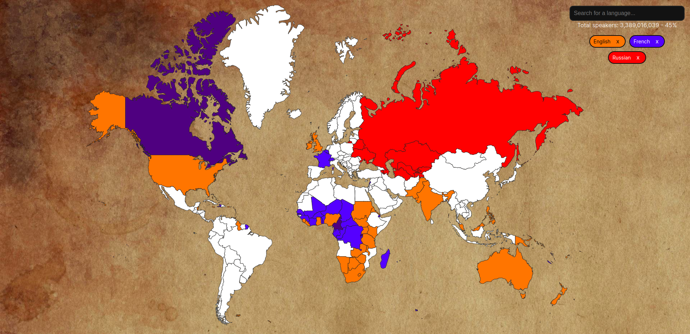

# Languages map



A map that shows how many people speak selected languages. You can click on countries to select/deselect the languages spoken there or just use the searchbar.

Check it out: [languages-world-map.web.app](languages-world-map.web.app)

### Running

```
npm install
npm run dev
```

### Map

The map was downloaded and slightly edited.  
You can find the original file [here](https://simplemaps.com/resources/svg-world).
